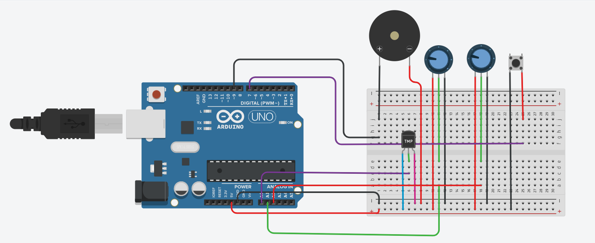

<h1 align="center"> Projeto de Monitoramento de Qualidade da Água com Arduino</h1>

# Detalhes do Projeto
Este projeto tem como objetivo monitorar a qualidade da água utilizando um Arduino. O sistema lê dados de temperatura, pH e qualidade da água, exibindo essas informações no Serial Monitor do Arduino. Além disso, um botão é usado para ativar um alarme sonoro através de um buzzer.
link para acesso ao arduino [https://www.tinkercad.com/things/btZ2kLt1366-cool-esboo?sharecode=RwmIPjCwwXdtb7x2cz8OFSp-08kVLIRbutCtrZ_JSUw]

# :hammer: Funcionalidades do projeto

- `Leitura de Temperatura`: O sensor de temperatura conectado ao pino A0 lê a temperatura da água e a converte para graus Celsius.
- `Leitura de pH`: O sensor de pH conectado ao pino A1 lê o valor do pH da água. Neste projeto, ele é simulado com um potenciômetro.
- `Leitura de Qualidade da Água`: O sensor de qualidade da água conectado ao pino A2 mede a qualidade da água, simulada por um potenciômetro. O valor é exibido em uma escala de 0 a 100%.
- `Exibição de Dados`: Os dados de temperatura, pH e qualidade da água são exibidos no Serial Monitor do Arduino, permitindo monitoramento em tempo real.
- `Alarme de Buzzer`: Um buzzer conectado ao pino 9 emite um som quando o botão conectado ao pino 7 é pressionado, funcionando como um alarme sonoro.

# Componentes Necessários
- 1 Arduino (UNO, Mega ou outro compatível
- 1 Sensor de Temperatura (NTC ou outro similar)
- 1 Sensor de pH (simulado com um potenciômetro)]
- 1 Sensor de Qualidade da Água (simulado com um potenciômetro)]
- 1 Buzzer
- 1 Botão
- Jumpers e Protoboard
  

# Circuito
- Conecte o Sensor de Temperatura ao pino A0 do Arduino.]
- Conecte o Sensor de pH ao pino A1 do Arduino (simulado com um potenciômetro
- Conecte o Sensor de Qualidade da Água ao pino A2 do Arduino (simulado com um potenciômetro)
- Conecte o pino central do botão ao pino 7 do Arduino e um dos pinos laterais ao GND
- Conecte o Buzzer ao pino 9 do Arduino

# Instruções de Uso
- As instruções estão presentes no arquivo de arduino.

# Requisitos e Dependências
- Arduino IDE: Certifique-se de ter a versão mais recente do Arduino IDE instalada no seu computador.
- Bibliotecas: diponível no código (tinkercad)
- Hardware: Componentes listados na seção de componentes necessários

# Observações
- Os sensores de pH e qualidade da água são simulados com potenciômetros. Para uma aplicação real, substitua-os por sensores adequados
- Ajuste os valores de mapeamento conforme necessário para calibrar corretamente os sensores utilizados
- Possíveis Melhorias
- Integração com um display LCD para exibição local dos dados
- Adição de conectividade Wi-Fi ou Bluetooth para monitoramento remoto
- Implementação de algoritmos de calibragem para aumentar a precisão dos sensores

# INTEGRANTES
- Yasmin Naomi Minemoto RM 559154
- Davi dos Reis Garcia RM 556741

